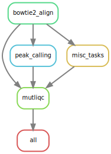

# Ultimate ATAC-seq Data Processing & Analysis Pipeline
From r**A**w (unaligned) BAM files to normali**Z**ed counts.

A Snakemake implementation of the [BSF's](https://www.biomedical-sequencing.org/) [ATAC-seq Data Processing Pipeline](https://github.com/berguner/atacseq_pipeline "ATAC-seq Data Processing Pipeline") extended by downstream processing and unsupervised analyses steps using bash, python and R. Reproducibility and Scalability is ensured by using Snakemake, conda and Singularity.



Table of contents
----------------
  * [Authors](#authors)
  * [Software](#software)
  * [Methods](#methods)
  * [Features](#features)
  * [Usage](#usage)
  * [Installation](#installation)
  * [Configuration](#configuration)
  * [Execution](#execution)
  * [Module](#module)
  * [Report](#report)
  * [Results](#results)
  * [Examples](#examples)
  * [Tips & FAQs](#tips)

# Authors
- [Stephan Reichl](https://github.com/sreichl)
- [Bekir Ergüner](https://github.com/berguner)
- [Daniele Barreca](https://github.com/DanieleBarreca)
- [Lukas Folkman](https://github.com/lukas-folkman)

# Software
This project wouldn't be possible without the following software
| Software       | Reference (DOI)                                   |
| -------------- | ------------------------------------------------- |
| bedtools       | https://doi.org/10.1093/bioinformatics/btq033     |
| Bowtie2        | https://doi.org/10.1038/nmeth.1923                |
| CQN            | https://doi.org/10.1093/biostatistics/kxr054      |
| deeptools      | https://doi.org/10.1093/nar/gkw257                |
| fastp          | https://doi.org/10.1093/bioinformatics/bty560     |
| HOMER          | https://doi.org/10.1016/j.molcel.2010.05.004      |
| MACS2          | https://doi.org/10.1186/gb-2008-9-9-r137          |
| matplotlib     | https://doi.org/10.1109/MCSE.2007.55              |
| MultiQC        | https://doi.org/10.1093/bioinformatics/btw354     |
| pybedtools     | https://doi.org/10.1093/bioinformatics/btr539     |
| pandas         | https://doi.org/10.5281/zenodo.3509134            |
| samblaster     | https://doi.org/10.1093/bioinformatics/btu314     |
| samtools       | https://doi.org/10.1093/bioinformatics/btp352     |
| scikit-learn   | http://jmlr.org/papers/v12/pedregosa11a.html      |
| seaborn        | https://doi.org/10.21105/joss.03021               |
| TMM            | https://doi.org/10.1186/gb-2010-11-3-r25          |
| UMAP           | https://doi.org/10.21105/joss.00861               |
| UROPA          | https://doi.org/10.1038/s41598-017-02464-y        |

# Methods
Method Template coming soon

# Features
- Processing
    - alignment of both single-end and paired-end reads in raw/unaligned BAM format (bowtie2)
    - peak calling (macs2)
    - peak annotation and motif analysis (homer)
    - MultiQC report generation (multiqc)
- Quantification
    - consensus region set generation
    - consensus region set annotation (uropa using regulatory build and gencode as refernce, and homer)
    - read count and peak support quantification of the consensus region set across samples, yielding a count and a support matrix with dimensions regions X samples
- optional: split data in multiple data subsets (eg by cell type, condition)
- Downstream Analysis (performed on the whole data set and each split separately)
    - region filtering
    - normalization by two different methods separately ([TMM](https://genomebiology.biomedcentral.com/articles/10.1186/gb-2010-11-3-r25) & [CQN](https://academic.oup.com/biostatistics/article/13/2/204/1746212))
    - highly variable region (HVR) selection for each normalized data set
- Visualization after each analysis step
    - step specific plots (eg region filtering, HVR selection)
    - dimensionality reduction by PCA & UMAP and plotting of provided metadata
    - mean-variance-relationship plot
- Snakemake report generation for workflow statistics, documentation, reproducibility and result presentation

# Usage
These steps are the recommended usage for the first run of the workflow:
1. perform only the processing, by setting the downstram_analysis flag to 0 in the project configuration
2. use the generated multiQC report (project_path/atacseq_report/multiqc_report.html) to judge the quality of your samples
3. fill out the mandatory quality control column (pass_qc) in the sample metadata configuration file (you can even use some of the quality metrics for plotting eg like I did in the example files with 'FRiP')
4. finally execute the remaining donwstream analysis steps by setting the respective flag to 1, thereby only the samples that passed quality control will be included

This workflow is written with snakemake and its usage is described in the [Snakemake Workflow Catalog](https://snakemake.github.io/snakemake-workflow-catalog?usage=sreichl/atacseq_pipeline).

# Installation
This should take less than 10 minutes.
1. install snakemake, which requires conda & mamba, according to the [documentation](https://snakemake.readthedocs.io/en/stable/getting_started/installation.html)
2. clone/download this repository (eg git clone https://github.com/sreichl/atacseq_pipeline.git)

All software/package dependencies are installed and managed automatically via Snakemake and conda (and optional Singularity) and installed upon the first run of the workflow.

# Configuration
Detailed specifications can be found here [./config/README.md](./config/README.md)

# Execution
## 1. Change working directory & activate conda environment
Execute always from within top level of the pipeline directory (ie atacseq_pipeline/).
Snakemake commands only work from within the snakemake conda environment.
```
cd atacseq_pipeline
conda activate snakemake
```
## 2. Execute a dry-run
command for a dry-run with option -n (-p makes Snakemake print the resulting shell command for illustration)
```
snakemake -p -n
```
## 3. Execute workflow local or on a cluster
### 3a. Local execution
command for execution with one core
```
snakemake -p -j1 --use-conda
```
### 3b. Cluster execution
command for **vanilla cluster execution** on cluster engines that support shell scripts and have access to a common filesystem, (e.g. the Sun Grid Engine), more info in the [Snakemake Cluster Execution documentation](https://snakemake.readthedocs.io/en/stable/executing/cluster.html)
```
snakemake -p --use-conda --cluster qsub -j 32
```

command for **cluster execution by using --profile**, submits every task as separate job with dependencies
```
snakemake -p --use-conda --profile config/slurm.cemm
```
the profile for CeMM's slurm environment is provided in the config/ directory, of note: 
- the number of jobs in the slurm.cemm/config.yaml should be set as high as necessary, because arrayed job subsmission does not work (yet) and the scheduler (eg SLURM) should take care of the priorization
- jobs which dependencies can never be fulfilled are automatically removed from the queue

If you are using another setup get your cluster execution profile here: [The Snakemake-Profiles project](https://github.com/snakemake-profiles/doc)

## X. Singularity execution (not tested)
Singularity has to be installed (system wide by root) and available/loaded (eg module load singularity).
The pipeline automatically loads the correct singularity image from [Dockerhub](https://hub.docker.com/r/sreichl/atacseq_pipeline)

command for execution with singularity, just add the flag --use-singularity and use --singularity-args to provide all the necessary directories the pipeline needs access to (in the example it is configured for the three relevant partitions at CeMM)
```
snakemake -p --use-conda --use-singularity --singularity-args "--bind /nobackup:/nobackup --bind /research:/research --bind /home:/home"
```
# Module
Use as module in another Snakemake workflow (soon)
- [https://snakemake.readthedocs.io/en/stable/snakefiles/modularization.html#snakefiles-modules](https://snakemake.readthedocs.io/en/stable/snakefiles/modularization.html#snakefiles-modules)
- [https://slides.com/johanneskoester/snakemake-6#/8](https://slides.com/johanneskoester/snakemake-6#/8)

# Report
command for report generation (this can take a few minutes, depending on the size of the dataset)
```
snakemake --report /absolute/path/to/report.zip
```

The command creates a self contained HTML based report in a zip archive containing the following sections:
- Workflow: interactive rulegraph to recapitulate individual steps, used software and conrete code (reproducibility)
- Statistics: duration and timing of individual steps
- Configuration: used pipeline configuration (accountability)
- Results
    - Configuration: all 3 used configuration files (project, samples, metadata)
    - QC reports: link to the MultiQC report
    - all: each step of the downstream analysis has its own searchable section with step-specific and unsupervised analysis plots
    - optional: one additional section per split, containing the respective downstream analysis results


# Results
Project directory structure:
- all: Downstream analysis results of the whole data, including consensus region set and region annotation
- atacseq_hub: genome browser track files (.bigWig) for each sample
- atacseq_report: statistics and metrics from the processing part as input for the MultiQC report
- atacseq_results: one directory per sample with all the processing and quantification results
- projectName_report.zip: self contained HTML Snakemake report
- split1 (optional): Downstream analysis results of subset 1 of the whole data
- split2 (optional): Downstream analysis results of subset 2 of the whole data

# Examples
We provide configuration files for two example datasets (mm10 & hg38).
Additionally, the report zip archive of the hg38 test example is provided to showcase the pipeline results.

# Tips
Here are some tips for troubleshooting & FAQs:
- always first perform a dry-run with option -n
- if unsure why a certain rule will be executed use option --reason in the dry run, this will give the reason for the execution of each rule
- when there are 3 or less samples all the UMAP data and plots will be empty
- when there are 2 or less samples all the PCA data and plots will be empty
- in case the pipeline crashes, you manually canceled your jobs or when snakemake tries to "resume.. resubmit.." jobs, then remove the .snakemake/incomplete directory!
- if you commit a lot of jobs eg via slurm (>500) this might take some time (ie 1s/job commit)
- two comments on peak support quantification
    - even though the peak support of a region in a certain sample is 0, does not mean that there are no reads counted in the count matrix, it just states that there was no peak called
    - the peak support can be >1 for certain samples in case of a consensus region that spans more than one region (with peaks) in the respective sample
- command for generating the workflow's rulegraph
```
snakemake --rulegraph --forceall | dot -Tsvg > workflow/dags/atacseq_pipeline_rulegraph.svg
```
provided in workflow/dags
- command for generating the directed acyclic graph (DAG) of all jobs with current configuration
```
snakemake --dag --forceall | dot -Tsvg > workflow/dags/all_DAG.svg
```
provided for both test examples in workflow/dags
