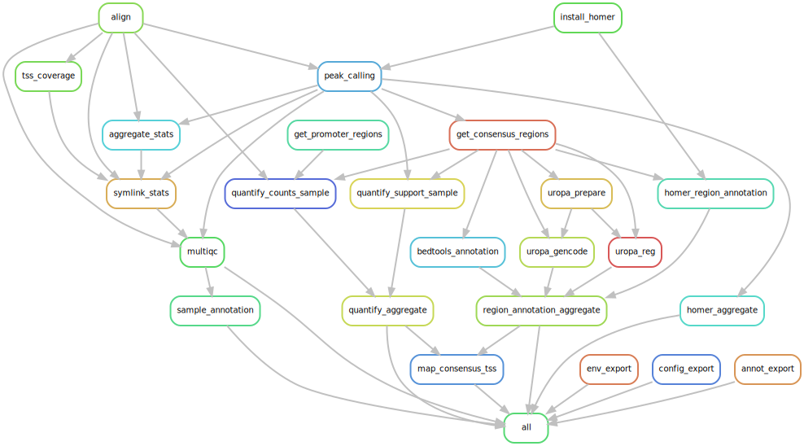

[](https://zenodo.org/doi/10.5281/zenodo.6323634)

# Ultimate ATAC-seq Data Processing & Quantification Pipeline

From r**A**w/un**A**ligned BAM files to count**Z**.
A [Snakemake](https://snakemake.readthedocs.io/en/stable/) workflow implementation of the [BSF's](https://www.biomedical-sequencing.org/) [ATAC-seq Data Processing Pipeline](https://github.com/berguner/atacseq_pipeline "ATAC-seq Data Processing Pipeline") extended by downstream quantification and annotation steps using Bash and Python.

This workflow adheres to the module specifications of [MR.PARETO](https://github.com/epigen/mr.pareto), an effort to augment research by modularizing (biomedical) data science. For more details and modules check out the project's repository.

**If you use this workflow in a publication, please don't forget to give credits to the authors by citing it using this DOI [10.5281/zenodo.6323634](https://doi.org/10.5281/zenodo.6323634).**



Table of contents
----------------
  * [Authors](#authors)
  * [Software](#software)
  * [Methods](#methods)
  * [Features](#features)
  * [Usage](#usage)
  * [Quality Control](#quality-control)
  * [Genome Browser Tracks](#genome-browser-tracks)
  * [Configuration](#configuration)
  * [Examples](#examples)
  * [Links](#links)
  * [Resources](#resources)
  * [Publications](#publications)

# Authors
- [Stephan Reichl](https://github.com/sreichl)
- [Bekir Ergüner](https://github.com/berguner)
- [Daniele Barreca](https://github.com/DanieleBarreca)
- [Lukas Folkman](https://github.com/lukas-folkman)
- [Lina Dobnikar](https://github.com/ld401)
- [Christoph Bock](https://github.com/chrbock)

# Software
This project wouldn't be possible without the following software and their dependencies:

| Software       | Reference (DOI)                                   |
| :------------: | :-----------------------------------------------: |
| bedtools       | https://doi.org/10.1093/bioinformatics/btq033     |
| Bowtie2        | https://doi.org/10.1038/nmeth.1923                |
| deeptools      | https://doi.org/10.1093/nar/gkw257                |
| ENCODE         | https://doi.org/10.1038/s41598-019-45839-z        |
| fastp          | https://doi.org/10.1093/bioinformatics/bty560     |
| HOMER          | https://doi.org/10.1016/j.molcel.2010.05.004      |
| MACS2          | https://doi.org/10.1186/gb-2008-9-9-r137          |
| MultiQC        | https://doi.org/10.1093/bioinformatics/btw354     |
| pybedtools     | https://doi.org/10.1093/bioinformatics/btr539     |
| pandas         | https://doi.org/10.5281/zenodo.3509134            |
| samblaster     | https://doi.org/10.1093/bioinformatics/btu314     |
| samtools       | https://doi.org/10.1093/bioinformatics/btp352     |
| Snakemake      | https://doi.org/10.12688/f1000research.29032.2    |
| UROPA          | https://doi.org/10.1038/s41598-017-02464-y        |

# Methods
This is a template for the Methods section of a scientific publication and is intended to serve as a starting point. Only retain paragraphs relevant to your analysis. References [ref] to the respective publications are curated in the software table above. Versions (ver) have to be read out from the respective conda environment specifications (workflow/envs/\*.yaml file) or post execution in the result directory (/envs/atacseq_pipeline/\*.yaml). Parameters that have to be adapted depending on the data or workflow configurations are denoted in squared brackets e.g., [X].

**Processing.**
Sequencing adapters were removed using the software fastp (ver) [ref]. Bowtie2 (ver) [ref] was used for the alignment of the short reads (representing locations of transposition events) to the [GRCh38 (hg38)/GRCm38 (mm10)] assembly of the [human/mouse] genome using the “--very-sensitive” parameter. PCR duplicates were marked using samblaster (ver) [ref]. Aligned BAM files were then sorted, filtered using ENCODE blacklisted regions [ref], and indexed using samtools (ver) [ref]. To detect the open chromatin regions, peak calling was performed using MACS2 (ver) [ref] using the “--nomodel”, “--keep-dup auto” and “--extsize 147” options on each sample. HOMER (ver) [ref] function findMotifs was used for motif enrichment analysis of the detected open chromatin regions. Quality control metrics were aggregated and reported using MultiQC (ver) [ref], [X] sample(s) needed to be removed.

**Quantification.**
A consensus region set, comprising of [X] genomic regions, was generated, by merging the identified peak summits, extended by [slop_extension]bp on both sides using the slop function from bedtools (ver) [ref] and pybedtools (ver) [ref], across all samples while again discarding peaks overlapping blacklisted features as defined by the ENCODE project [ref]. The consensus region set was used to quantify the chromatin accessibility in each sample by summing the number of reads overlapping each consensus region. The consensus region set, and sample-wise quantification of accessibility was performed using bedtools (ver) [ref] and pybedtools (ver) [ref].

**Annotation.**
Consensus regions were annotated using annotatePeaks function from HOMER (ver) [ref]. Additionally, we annotated all consensus regions using UROPA (ver) [ref] and genomic features from the [GENCODE vX] basic gene annotation as: “TSS proximal” if the region’s midpoint was within [X] bp upstream or [X] bp downstream from a TSS, or if the region overlapped with a TSS; “gene body” if the region overlapped with a gene; “distal” if the region’s midpoint was within [X] bp of a TSS; and “intergenic” otherwise. For each region, only the closest feature was considered, and the annotations took precedence in the following order: TSS proximal, gene body, distal, and intergenic. 

The processing and quantification described here was performed using a publicly available Snakemake [ver] (ref) workflow [[10.5281/zenodo.6323634](https://doi.org/10.5281/zenodo.6323634)].

# Features
- Processing (results/)
    - Alignment of both single-end and paired-end reads in raw/unaligned BAM format with Bowtie2.
    - Peak calling with MAC2.
      - Note: even though the peak support of a region in a certain sample is 0, does not mean that there are no reads counted in the count matrix, it just states that there was no peak called.
      - Note: the peak support can be >1 for certain samples in case of a consensus region spanning more than one peak within the respective sample.
    - Peak annotation and motif analysis HOMER.
    - Coverage analysis generating bigWig files (hub/) and quantifying TSS coverage (results/).
- Reporting (report/)
    - MultiQC report generation using MultiQC, extended with an in-house developed plugin [atacseq_report](./workflow/scripts/multiqc_atacseq).
- Quantification (counts/)
    - Consensus region set generation across all called peaks.
    - Read count and peak support quantification of the consensus regions across samples, yielding a count and a support matrix with dimensions regions X samples.
- Annotation (counts/) of the consensus region set using
    -  UROPA with regulatory build and gencode as references
    -  HOMER with annotatePeaks.pl
    -  bedtools for nucleotide counts/content (e.g., % of GC)
- UCSC Genome Browser Trackhub (hub/)

# Usage
These steps are the recommended usage for this workflow:

0. Configure the workflow by pointing to the relevant resources, e.g., downloaded from Zenodo for [hg38 or mm10 (see instructions below)](#resources).
1. Perform only the processing, by setting the pass_qc annotation for all samples to 0.
2. Use the generated MultiQC report (result_path/ataceq_pipeline/report/multiqc_report.html) to judge the quality of each sample (see tips in the next section on [Quality Control](#quality-control)).
3. Fill out the mandatory quality control column (pass_qc) in the annotation file accordingly (everything >0 will be included in the downstream steps).
4. Finally, execute the remaining downstream quantification and annotation steps by running the workflow. Thereby only the samples that passed quality control will be included in the consensus region set generation (i.e., the feature space) and all downstream steps.

This workflow is written with Snakemake and its usage is described in the [Snakemake Workflow Catalog](https://snakemake.github.io/snakemake-workflow-catalog?usage=epigen/atacseq_pipeline).

# Quality Control
Below are some guidelines for the manual quality control of each sample, but keep in mind that every experiment/dataset is different.

1. Reads Mapped ~ $30\cdot 10^{6}$ ($>20\cdot 10^{6}$ at least)
2. % Aligned >90%
3. % Mitochondrial <10%
4. Peaks (depend on reads)
    - FriP (Fraction of reads in Peaks) ~ >20% (can be misleading as 80-90% are also not good)
    - Regulatory regions >10% (as it is roughly 10% of the genome)
    - TSS (Transcription Start Site) normalized coverage ideally > 4 (at least >2)
    - % Duplications “not excessive”
5. Inspect [Genome Browser Tracks](#genome-browser-tracks) using UCSC Genome Browser (online) or IGV (local)
    - Compare all samples to the best, based on above's QC metrics.
    - Check cell type / experiment-specific markers for accessibility as positive controls.
    - Check e.g., developmental regions for accessibility as negative controls.
6. [Unsupervised Analysis](https://github.com/epigen/unsupervised_analysis) (e.g., PCA or UMAP)
    - Identify outliers/drivers of variation, especially in the control samples and within replicates.
  
My personal QC value scheme to inform downstream analyses (e.g., unsupervised analysis)
- 0 = did not pass
- 2 options
  - for every metric that is not ok subtract 0.25 from 1, which means it requires 4 “strikes” for a sample to be removed due to low quality.
  - alternative
      - 0.5 = passed with reservations (e.g., metrics and genome browser tracks were not optimal, but still good enough)
      - 0.75 = not ideal (e.g., at least metrics or IGV tracks were not optimal)
- 1 = passed (perfect)

Finally, a previous PhD student in our lab, [André Rendeiro](https://orcid.org/0000-0001-9362-5373), wrote about ["ATAC-seq sample quality, wet lab troubleshooting and advice"](https://github.com/epigen/open_pipelines/blob/master/pipelines/atacseq.md#sample-quality-wet-lab-troubleshooting-and-advice).

# Genome Browser Tracks
The `hub` directory contains the read coverage per sample in .bigWig format for visual inspection of each sample e.g., during QC. Below are instructions for two different approaches (online/local).

## UCSC Genome Browser Track Hub (online)
0. Requirement: web server.
1. Copy (or symlink) the `hub` directory to an accessible location on your web server (=web_server_location).
2. Create a UCSC Genome Browser hyperlink
    - the general formula is: ucsc_url + genome + web_server_location + hub/hub.txt
    - concretely: `http://genome-euro.ucsc.edu/cgi-bin/hgTracks?db=` + {genome} + `&hubUrl=` + {web_server_location} + `hub/hub.txt`
    - [mm10test](http://genome-euro.ucsc.edu/cgi-bin/hgTracks?db=mm10&hubUrl=https://medical-epigenomics.org/data/atacseq_pipeline/mm10test/hub/hub.txt): `http://genome-euro.ucsc.edu/cgi-bin/hgTracks?db=mm10&hubUrl=https://medical-epigenomics.org/data/atacseq_pipeline/mm10test/hub/hub.txt`
    - [hg38test](http://genome-euro.ucsc.edu/cgi-bin/hgTracks?db=hg38&hubUrl=https://medical-epigenomics.org/data/atacseq_pipeline/hg38test/hub/hub.txt): `http://genome-euro.ucsc.edu/cgi-bin/hgTracks?db=hg38&hubUrl=https://medical-epigenomics.org/data/atacseq_pipeline/hg38test/hub/hub.txt`
3. Share the link with the world e.g., collaborators or upon publication of your data.

## IGV: Integrative Genomics Viewer (local)
0. Requirement: [IGV Desktop application](https://igv.org/doc/desktop/).
1. Open IGV.
2. Select genome.
3. Drag and drop all/selected .bigWig files from the `hub` directory directly into the IGV application.

# Configuration
Detailed specifications can be found here [./config/README.md](./config/README.md)

# Examples
We provide data, annotation and configuration files for two example datasets (hg38 & mm10) in [./.test](./.test).
In both cases the data was generated for test purposes only by downsampling real ATAC-seq samples using samtools.
```console
samtools view -s .0001 real_sample.bam -b > test_sample.bam
```
The pass_qc attribute is set 0 for all samples, because now peaks are detecable in the data for downstream quantification.

# Links
- [GitHub Repository](https://github.com/epigen/atacseq_pipeline/)
- [GitHub Page](https://epigen.github.io/atacseq_pipeline/)
- [Zenodo Repository](https://doi.org/10.5281/zenodo.6323634)
- [Snakemake Workflow Catalog Entry](https://snakemake.github.io/snakemake-workflow-catalog?usage=epigen/atacseq_pipeline)

# Resources
- Data Resources: To ensure the reproducibility of results and to make the workflow accessible we provide all required reference data for the analysis of ATAC-seq samples for [human GRCh38 (hg38)](https://doi.org/10.5281/zenodo.6344173) and [mouse GRCm38 (mm10)](https://doi.org/10.5281/zenodo.6344321) genomes on Zendodo.
  ```console
  # download Zenodo records using zenodo_get

  # install zenodo_get v1.3.4
  conda install -c conda-forge zenodo_get=1.3.4

  # human GRCh38 (hg38)
  zenodo_get --record 6344173 --output-dir=resources/atacseq_pipeline/hg38/
  cd resources/atacseq_pipeline/hg38
  unzip indices_for_Bowtie2.zip && rm indices_for_Bowtie2.zip

  # mouse GRCm38 (mm10)
  zenodo_get --record 6344322 --output-dir=resources/atacseq_pipeline/mm10/
  cd resources/atacseq_pipeline/mm10
  unzip indices_for_Bowtie2.zip && rm indices_for_Bowtie2.zip
  ```
- Recommended [MR.PARETO](https://github.com/epigen/mr.pareto) modules for downstream analyses (in that order):
  - [<ins>Sp</ins>lit, F<ins>ilter</ins>, Norma<ins>lize</ins> and <ins>Integrate</ins> Sequencing Data](https://github.com/epigen/spilterlize_integrate/) after quantification.
  - [Unsupervised Analysis](https://github.com/epigen/unsupervised_analysis) to understand and visualize similarities and variations between samples.
  - [Differential Analysis with limma](https://github.com/epigen/dea_limma) to identify and visualize statistically significant genomic regions between sample groups.
  - [Enrichment Analysis](https://github.com/epigen/enrichment_analysis) for biomedical interpretation of differential analysis results.
  - [Genome Tracks](https://github.com/epigen/genome_tracks) for visualization of genomic regions of interest or top hits.

# Publications
The following publications successfully used this module for their analyses.
- [Casteels et al. (2022) Cell Reports - SMNDC1 links chromatin remodeling and splicing to regulate pancreatic hormone expression.](https://doi.org/10.1016/j.celrep.2022.111288)
- ...
